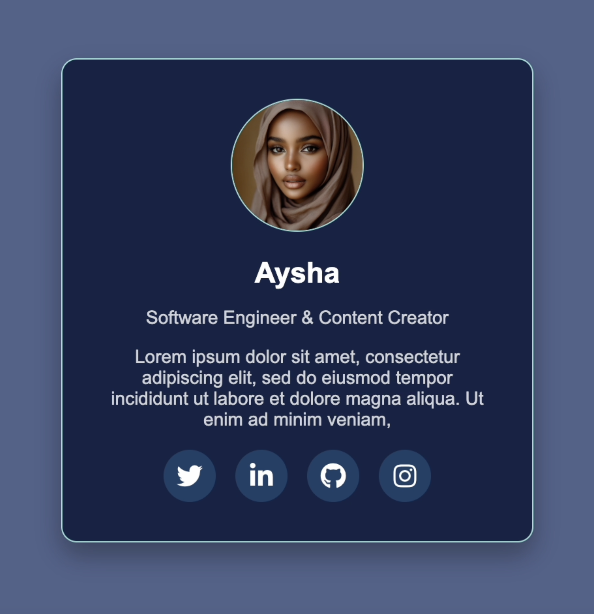

# Day 15 - Profile Card with Social Media Hover Effects  

## 🎯 Project Overview  
This project showcases a **beautiful profile card** built with **HTML & CSS**, featuring:  
✅ A **dark blue theme**
✅ **Smooth hover effects** for social media icons  
✅ A **responsive layout** that works on all screen sizes  
✅ A **clean, modern design** perfect for portfolios and personal websites  

---

## 🛠️ Technologies Used
- HTML
- CSS (with transitions for smooth effects)
- JavaScript (for toggling answers)

---
# Demo page

Click [Here](https://ayshasanyang.github.io/Day-15-Profile-Card/) to view the page

## 🚀 How to Run
1. Download or clone the repository
```bash
git clone https://github.com/ayshasanyang/Day-15-Profile-Card.git
```
2. Navigate to the project folder.
3. Open the project files in your vscode or any code editor of your choice
4. Open the `index.html` file in your web browser.

---

## 📸 Preview
 

---

Made with ❤️ by [AYSHA] 🚀